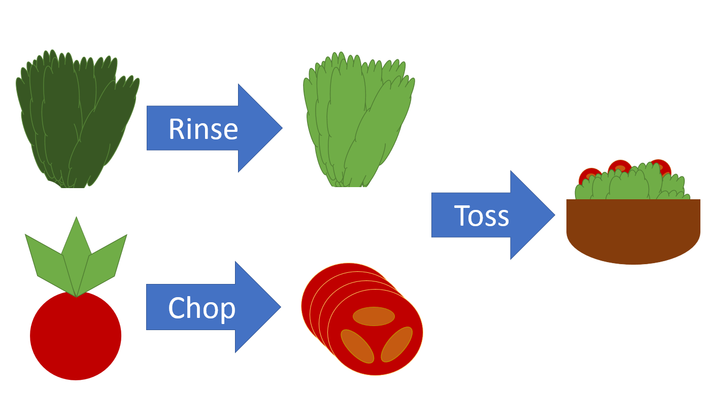
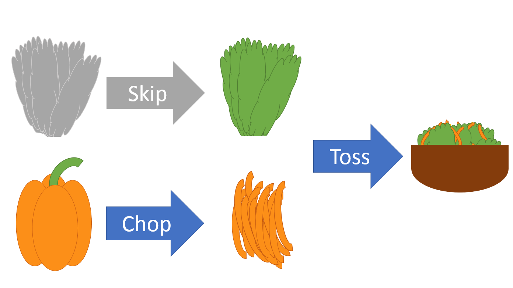

<script src="https://ajax.googleapis.com/ajax/libs/jquery/1.12.2/jquery.min.js"></script>

<script>
  $(document).ready(function() {
    $('slide').append('<footer></footer>');    
    $('footer').attr('label', 'Copyright 2017 Eli Lilly and Company');
  })
</script>

```{r setup, echo=FALSE}
suppressWarnings(library(drake))
suppressWarnings(library(magrittr))
clean()
```


## Data Frames in R for Make

<div style="text-align: center; padding-bottom: 25px">
  
</div>

<ol style = "font-size: 1.5em">
  <li>Save time</li>
  <li>Stay reproducible</li>
  <li>Organize your project</li>
</ol>

## From a colleague

<br/>
<br/>
<br/>
<br/>
<div style="font-size: 2.5em; font-style: italic">
"The fastest code is the code you do not run."
</div>
<br/>

## Kirill Müller's cooking analogy

<br/>
<div align="center">
  
</div>


## Change recipe and reuse leftovers

<br/>
<div align="center">
  
</div>

# Plan a project

## Your plan is a data frame

```{r load, echo = FALSE}

## Drake finds your packages and functions

library(drake)
library(knitr)
library(rmarkdown)
clean()

simulate = function(n){
  data.frame(
    x = rnorm(n),
    y = rpois(n, 1)
  )
}
```

```{r data, echo = FALSE}

## Plan for datasets

data_plan = plan(
  small = simulate(5),
  large = simulate(50)
)
# data_plan
```

```{r knitr, echo = FALSE}

## Analysis functions

reg1 = function(d){
  lm(y ~ x, data = d)
}

reg2 = function(d){
  d$x2 = d$x^2
  lm(y ~ x2, data = d)
}
```

```{r analyses, echo = FALSE}

## Analysis methods

methods = plan(
  regression1 = reg1(..dataset..),
  regression2 = reg2(..dataset..)
)
# methods
```

```{r analysis_plan, echo = FALSE}
## Analysis plan

analysis_plan = analyses(methods, data = data_plan)
# analysis_plan
```

```{r, echo = FALSE}
## Generate your plan

#<div style="font-size: 1.5em">
#- `analyses()`
#- `summaries()`
#- `expand()`
#- `evaluate()`
#- `gather()`
#</div>
```

```{r write, echo = FALSE, comment = ""}
## knitr report
lines = c(
  "---",
  "title: Example Report",
  "author: You",
  "output: html_document",
  "---",
  "",
  "Read targets from the drake cache",
  "",
  "```{r my_chunk}",
  "library(drake)",
  "readd(small)",
  "loadd(large, regression2_small)",
  "summary(regression2_small)",
  "head(large)",
  "```"
)
writeLines(lines, "report.Rmd")
# cat(system2("cat", args = "report.Rmd", stdout = TRUE), sep = "\n")
```

```{r filedeps, echo = FALSE}
## File dependencies

# Knit and render a dynamic knitr report
my_knit = function(file, ...){
  knit(file, quiet = TRUE) # drake knows you loaded the knitr package
}
```


```{r, echo = FALSE}
# - Plan your report similarly
load_in_report = plan(
  report_dependencies = c(small, large, regression2_small))

report_plan = plan(
  report.md = my_knit('report.Rmd', report_dependencies),
  file_targets = TRUE, strings_in_dots = "filenames")
report_plan = rbind(report_plan, load_in_report)
```

```{r show_report_plan, echo = FALSE}
#report_plan
```

```{r plan1, echo = FALSE}
whole_plan = rbind(report_plan, data_plan, analysis_plan)
```

```{r show_whole_plan}
whole_plan
```

## Minimize typing

```{r}
methods
analyses(plan = methods, datasets = data_plan)
```

## Minimize typing

<div style="font-size: 1.5em">
- `plan()`
- `analyses()`
- `summaries()`
- `expand()`
- `evaluate()`
- `gather()`
</div>

## The dependency graph

```{r graph, echo = FALSE, fig.cap = NULL}
plot_graph(whole_plan)
```

## The dependency graph

<div style="font-size: 1.5em">
- `plot_graph()`
- `build_graph()` ([igraph](https://cran.r-project.org/package=igraph) object)
- `read_graph()` (run project first)
- `tracked()` (just list the nodes)
</div>


# Run the project

## Run the project {.smaller}

```{r firstmake}
make(whole_plan)
```

## What did you make? How did it go?

```{r firststatus}
status() # see also: session()
```

## <span style="font-size: 0.8em">Reproducibility: the results match the code</span>

```{r firstuptodate}
make(whole_plan)
```

## <span style="font-size: 0.8em">Reproducibility: the results match the code</span>

```{r status}
status() # Set imported_files_only=TRUE to ignore imported non-files.
```

## Access the output

```{r readfromcache}
head(cached()) # some of the cached objects
readd(small) # loadd(small, large)
```

## Change an ingredient

```{r original_reg2}
reg2
```

```{r changefn}
reg2 = function(d){
  d$x3 = d$x^3 # new cubic term
  lm(y ~ x3, data = d)
}
```

## Reuse your leftovers

```{r newmake}
make(whole_plan)
```

## Reuse your leftovers

```{r statusnewmake}
status(imported_files_only = TRUE)
```

# High-performance computing

## <span style="font-size: 0.8em">Auto-magically switch on parallel computing</span>

- Parallel processes (multiple chefs)

```r
make(whole_plan, jobs = 2) # Backend chosen based on platform.
make(whole_plan, parallelism = "mclapply", jobs = 2) # Mac/Linux
make(whole_plan, parallelism = "parLapply", jobs = 2) # Windows too
```

- Parallel R sessions (multiple kitchens)

```{r eval = FALSE} 
make(whole_plan, parallelism = "Makefile", jobs = 2)
make(whole_plan, parallelism = "Makefile", command = "make", 
     args = c("--jobs=2", "--silent")) 
```

## Supercomputing

<div style="font-size: 0.9em">
`my_script.R`
```{r shell, eval = FALSE}
...
make(whole_plan, parallelism = "Makefile", jobs = 8,
  prepend = "SHELL = ./shell.sh")
```

`shell.sh`
```{r shellfile, eval = FALSE}
#!/bin/bash
shift
echo "module load R; $*" | qsub -sync y -cwd -j y
```

Run on a cluster or supercomputer.
```{r submit, eval = FALSE}
chmod +x shell.sh
nohup nice -19 R CMD BATCH my_script.R &
```
</div>

## Try it out

```{r getbasic, eval = FALSE}
install.packages("drake")
library(drake)
example_drake("basic") # Write example code to try.
vignette(package = "drake") # List the vignettes.
vignette("drake") # high-level overview
vignette("quickstart") # annotated example
vignette("caution") # avoid pitfalls
```

- Rendered vignettes: 
  - [https://CRAN.R-project.org/package=drake/vignettes](https://CRAN.R-project.org/package=drake/vignettes)
- Bug reports, issues, feature requests:
  - [https://github.com/wlandau-lilly/drake/issues](https://github.com/wlandau-lilly/drake/issues)

```{r cleanup, echo=F}
clean(destroy = TRUE)
unlink("report.Rmd")
```

## Inspiration

- Huge inspiration: the remake package by Rich FitzJohn
    - [https://github.com/richfitz/remake](https://github.com/richfitz/remake)
- GNU Make
    - [https://www.gnu.org/software/make](https://www.gnu.org/software/make)

## Sources

- FitzJohn, Rich. "Remake: Make-like declarative workflows in R." 2017. R package version 0.3.0. GitHub repository, [https://github.com/richfitz/remake](https://github.com/richfitz/remake).
- Landau, William M. "Drake: data frames in R for Make." R package version 3.0.0. [https://CRAN.R-project.org/package=drake](https://CRAN.R-project.org/package=drake).
- Müller, Kirill. "Reproducible workflows with R." Zurich R user meetup. April 10, 2017. [https://krlmlr.github.io/remake-slides](https://krlmlr.github.io/remake-slides).
- Stallman, Richard M. and McGrath, Roland and Smith, Paul D. <u>GNU Make: A Program for Directing Recompilation, for version 3.81</u>. Free Software Foundation, 2004.
