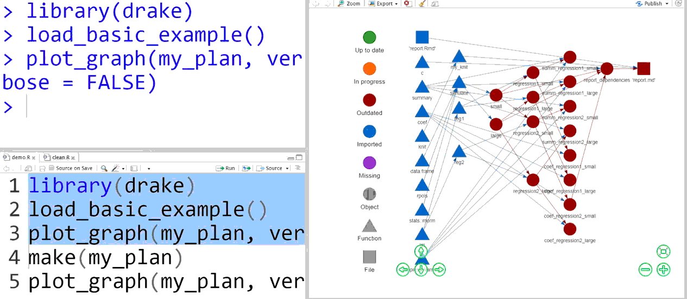

## drake in action

<h1 align="center">
  
</h1>


## Workflow plan data frame

```{r plandf}
library(drake)
load_basic_example()
my_plan
```

## Network graph 

```r
# The graph is interactive! Hover, click, drag, zoom, pan.
plot_graph(my_plan)
```

```{r graph, echo = FALSE}
plot_graph(my_plan, width = "100%", height = "400px", verbose = FALSE,
  file = "graph1.html", font_size = 25)
```

<iframe src="graph1.html" width = "100%" height = "500px" allowtransparency="true"></iframe>


## Just the targets

```r
plot_graph(my_plan, targets_only = TRUE)
```

```{r graphtargs, echo = FALSE}
plot_graph(my_plan, targets_only = TRUE, width = "100%", height = "400px", verbose = FALSE, file = "graph2.html", font_size = 25)
```

<iframe src="graph2.html" width = "100%" height = "500px" allowtransparency="true"></iframe>


## Execution

```{r make1}
make(my_plan)
```

## Results 

```{r}
loadd(small)
small
readd(coef_regression2_large)
```

## Reproducibility 


```r
plot_graph(my_plan)
```

```{r make2, echo = FALSE}
plot_graph(my_plan, width = "100%", height = "400px", verbose = FALSE, file = "graph3.html", font_size = 25)
```

<iframe src="graph3.html" width = "100%" height = "500px" allowtransparency="true"></iframe>


## Reproducibility 

```{r make3}
reg2 = function(d){ # Change one of your functions.
  d$x3 = d$x^3
  lm(y ~ x3, data = d)
}
outdated(my_plan, verbose = FALSE) # Some targets are now out of date.
missed(my_plan, verbose = FALSE) # But our workspace has all we need.
```

## Reproducibility 

```r
plot_graph(my_plan)
```

```{r plotgraphreg3, echo = FALSE}
plot_graph(my_plan, width = "100%", height = "400px", verbose = FALSE, file = "graph4.html", font_size = 25)
```

<iframe src="graph4.html" width = "100%" height = "500px" allowtransparency="true"></iframe>


## Reproducibility 
```{r rebuildreg3}
make(my_plan) # Only rebuild the outdated targets.
```

## High-performance computing 

<div class="left">How many jobs could help?</div>

```r
max_useful_jobs(my_plan)
```

<div class="left">Parallel processes: low overhead, light weight</div>

```r
make(my_plan, jobs = 2) # Backend chosen based on platform.
make(my_plan, parallelism = "mclapply", jobs = 2) # Mac/Linux
make(my_plan, parallelism = "parLapply", jobs = 2) # Windows too
```

<div class="left">Parallel R sessions: high overhead, heavy duty</div>

```{r eval = FALSE} 
make(my_plan, parallelism = "Makefile", jobs = 2)
make(my_plan, parallelism = "Makefile", command = "make", 
     args = c("--jobs=2", "--silent")) 
```

## Supercomputing 

<div style="font-size: 0.9em">
<div class="left">`my_script.R`</div>
```{r shell, eval = FALSE}
# Your setup...
make(my_plan, parallelism = "Makefile", jobs = 8,
  prepend = "SHELL = ./shell.sh")
```

<div class="left">`shell.sh` (write with shell_file())</div>
```{r shellfile, eval = FALSE}
#!/bin/bash
shift
echo "module load R; $*" | qsub -sync y -cwd -j y
```

<div class="left">Run on a cluster or supercomputer.</div>
```{r submit, eval = FALSE}
chmod +x shell.sh
nohup nice -19 R CMD BATCH my_script.R &
```
</div>

## Utilities 

<section>
<div style="float:left; width: 50%; text-align: center">
Workflow plan
```r
plan()
analyses()
summaries()
evaluate()
expand()
gather()
```

Dependency network
```r
outdated()
missed()
plot_graph()
read_graph()
dataframes_graph()
deps()
tracked()
max_useful_jobs()
```
</div>
<div id="float:right; width: 50%; text-align: center">
Cache
```r
clean()
cached()
imported()
built()
readd()
loadd()
find_project()
find_cache()
```

Debugging
```r
check()
session()
in_progress()
progress()
read_config()
```

</div>
</section>

## Learning 

<div class="left">- Basic example</div>
```r
load_basic_example()
examples_drake() # List examples.
example_drake("basic") # Generate code files.
```

<div class="left">- Tutorials</div>
```{r getbasic, eval = FALSE}
vignette("drake") # High-level overview.
vignette("quickstart") # Deep dive.
vignette("caution") # Pitfalls.
```

- Rendered tutorials: [https://CRAN.R-project.org/package=drake/vignettes](https://CRAN.R-project.org/package=drake/vignettes)
- Bug reports, issues, feature requests: [https://github.com/wlandau-lilly/drake/issues](https://github.com/wlandau-lilly/drake/issues)

```{r cleanup, echo=F}
clean(destroy = TRUE)
unlink("report.Rmd")
```

## Similar work 

- Main inspiration: [remake](https://github.com/richfitz/remake) (FitzJohn)
- [GNU Make](https://www.gnu.org/software/make) (GNU Project)
- Packages for caching and tracking:
    - [archivist](https://cran.r-project.org/package=archivist) (Biecek et al.)
    - [memoise](https://cran.r-project.org/package=memoise) (Wickham et al.)
    - [R.cache](https://cran.r-project.org/package=R.cache) (Bengtsson)
    - [trackr](https://github.com/gmbecker/recordr) (Moore and Becker)
- CRAN task views:
    - [reproducible research](https://CRAN.R-project.org/view=ReproducibleResearch)
    - [high-performance computing](	https://CRAN.R-project.org/view=HighPerformanceComputing)

## Sources 

<ul style = "font-size: 0.65em">
<li>
Bengtsson, Henrik. "R.cache: Fast and light-eeight caching (memoization) of objects and results to speed up computations." 2015. R package version 0.12.0. [https://CRAN.R-project.org/package=R.cache](https://CRAN.R-project.org/package=R.cache).
</li>
<li>
Biecek, Przemyslaw and Kosinki, Marcin. "archivist: an R package for managing, recording, and restoring data analysis results." 2016. R package version 2.1.2. [https://CRAN.R-project.org/package=archivist](https://CRAN.R-project.org/package=archivist).
</li>
<li>
FitzJohn, Rich. "remake: Make-like declarative workflows in R." 2017. R package version 0.3.0. GitHub repository, [https://github.com/richfitz/remake](https://github.com/richfitz/remake).
</li>
<li>
Landau, William M. "Drake: data frames in R for Make." 2017. R package version 4.0.0. [https://CRAN.R-project.org/package=drake](https://CRAN.R-project.org/package=drake).
</li>
<li>
Moore, Sara and Becker, Gabriel. "trackr: Semantic annotation and discoverability system for R-based artifacts." 2017. R package version 0.7.4. [https://github.com/gmbecker/recordr](https://github.com/gmbecker/recordr).
</li>
<li>
Müller, Kirill. "Reproducible workflows with R." Zurich R user meetup. April 10, 2017. [https://krlmlr.github.io/remake-slides](https://krlmlr.github.io/remake-slides).
</li>
<li>
Stallman, Richard M. and McGrath, Roland and Smith, Paul D. <u>GNU Make: A Program for Directing Recompilation, for version 3.81</u>. Free Software Foundation, 2004.
<li>
Wickham, Hadley and Hester, Jim and Müller, Kirill. "memoise: Memoisation of functions." R package version 1.0.0. [https://CRAN.R-project.org/package=memoise](https://CRAN.R-project.org/package=memoise)
</li>
