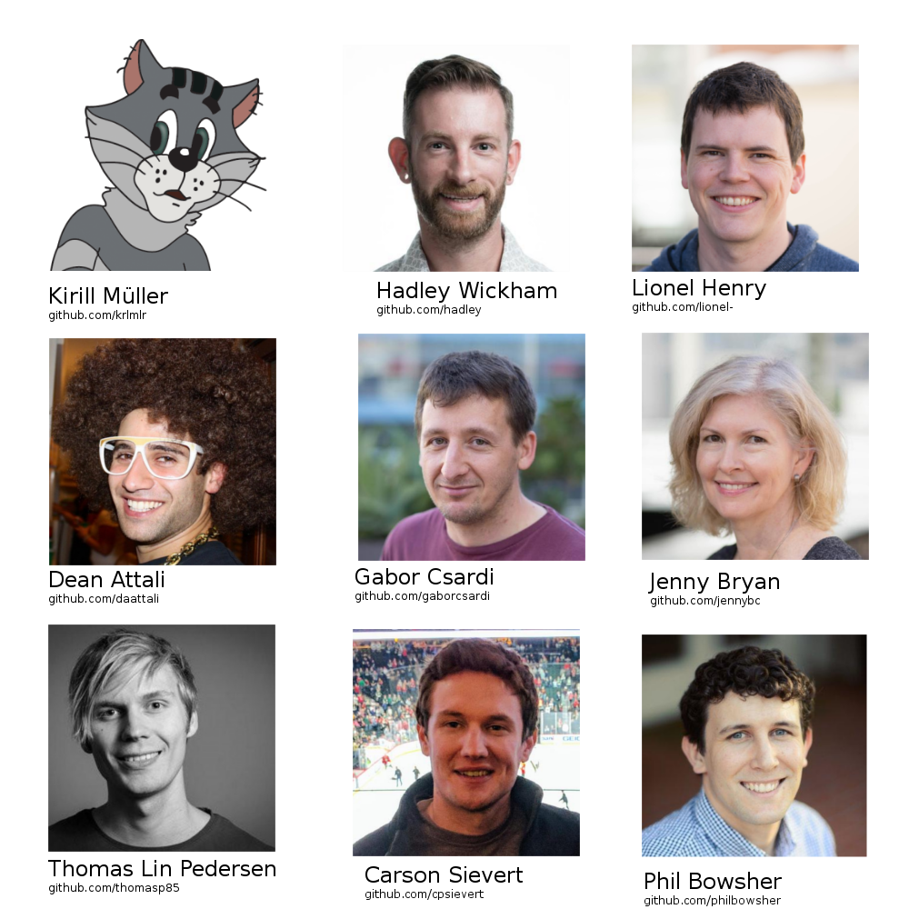
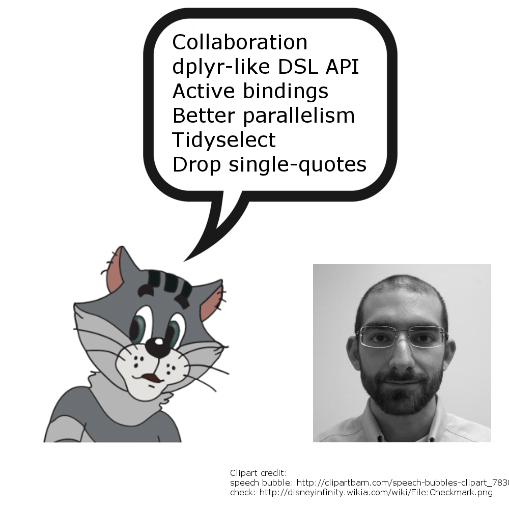
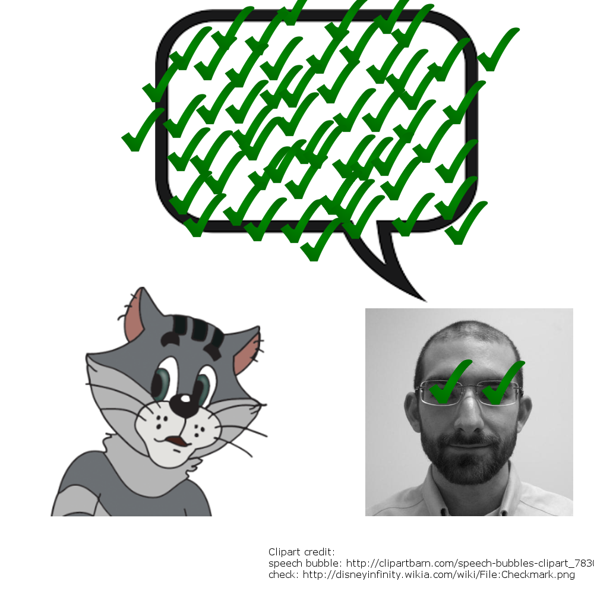

```{r setup, include=FALSE}
options(htmltools.dir.version = FALSE)
options(width = 65)
knit_print.data.frame <- function(x, ...) paste0(format(as_tibble(x)), collapse = "\n")
knitr::opts_chunk$set(collapse = TRUE)
```


## The best part: meeting these people and many others




## Kirill joined my favorite project



## Kirill joined my favorite project



## My favorite presentations

- Kirill: https://krlmlr.github.io/drake-pitch (featured in https://github.com/jennybc/what-they-forgot)
- Thomas: https://www.data-imaginist.com/slides/rstudioconf2018/assets/player/keynotedhtmlplayer#0
- Carson: https://talks.cpsievert.me/20180202/
- JJ Alaire: https://beta.rstudioconnect.com/ml-with-tensorflow-and-r/
- Di Cook: http://www.dicook.org/files/rstudio/
- Collection of slide decks: https://github.com/simecek/RStudioConf2018Slides

## Tidy evaluation

- Lots of hard work by Lionel.
- Best part of Hadley's workshop on extending the tidyverse.
- Tidy eval in 5 minutes: https://www.youtube.com/watch?v=nERXS3ssntw
- Let's look at some code...
